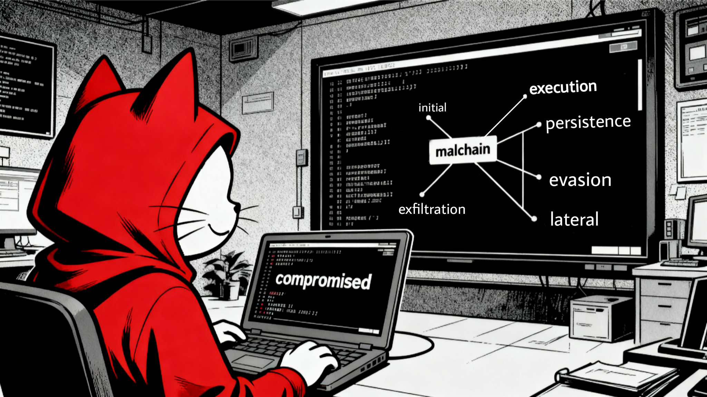

# Framework Table

  

| Initial Access | Execution | Persistence | Defense Evasion | Lateral Movement | Exfiltration |
|----------------|-----------|-------------|------------------|------------------|--------------|
| Removable Media / File Sharing | User-Executed Files | Startup Folder & Autorun Entries | Obfuscation & Packing | Living Off the Land | HTTP / HTTPS |
| Malvertising | Script Execution | Scheduled Task / Cron | Fileless Malware | File Shares / Network Drives | DNS Tunneling |
| Supply Chain Compromise | Service Execution | Registry-Based Execution | Disabling Security Tools | Worm-like Propagation | Cloud Storage Abuse |
| Stolen or Weak Credentials | DLL Hijacking / Side-Loading | Browser Extensions | Masquerading / Impersonation | | Social Media / Messaging C2 |
| Malicious / Compromised USB Devices | WMI Execution | AppInit_DLLs & IFEO | Environment Checks / Sandbox Evasion | | FTP / SFTP / FTPS |
| Watering Hole Attacks | Boot or Firmware Execution | Fileless Persistence | Process Injection |  | Tor / Proxies / VPNs |
| | Browser Extensions / Plugins | Service Installation | Polymorphism & Metamorphism |  | Encrypted Channels (AES/RSA) |
